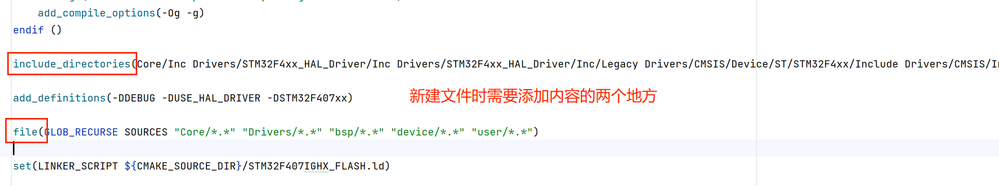
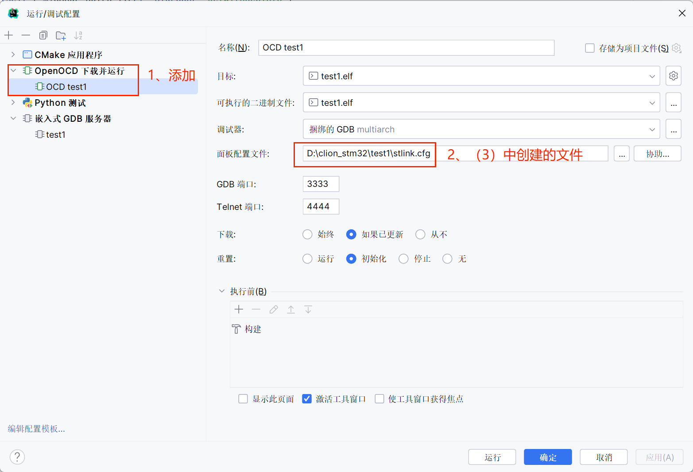
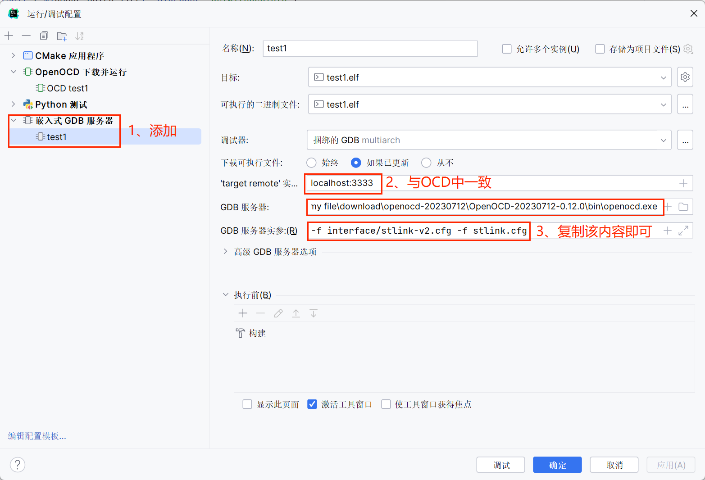
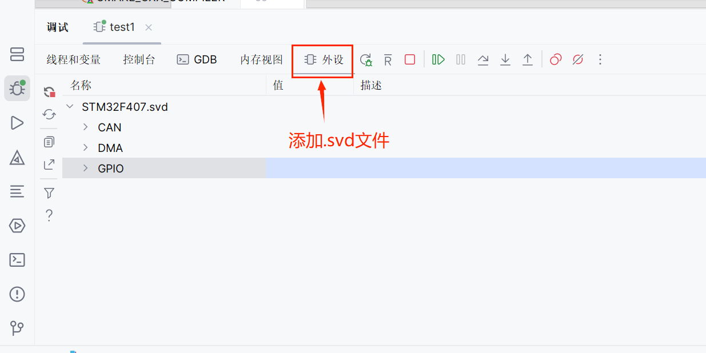
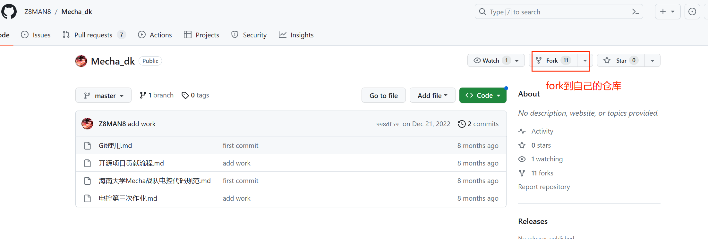
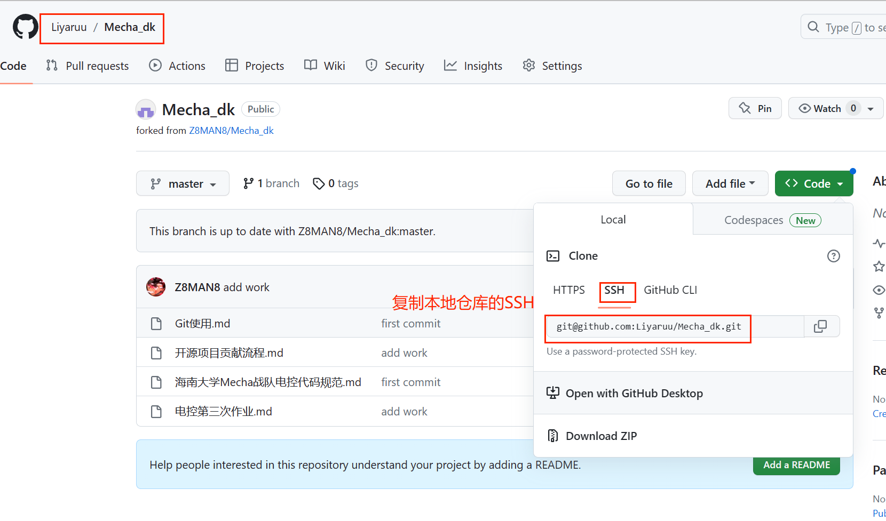
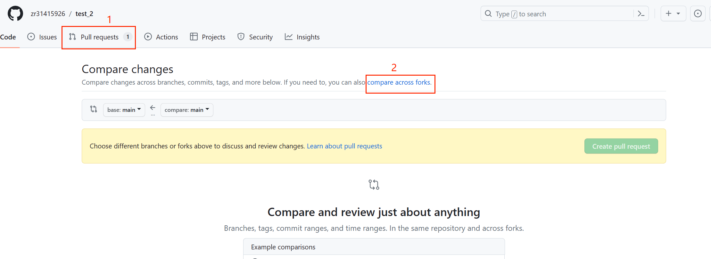
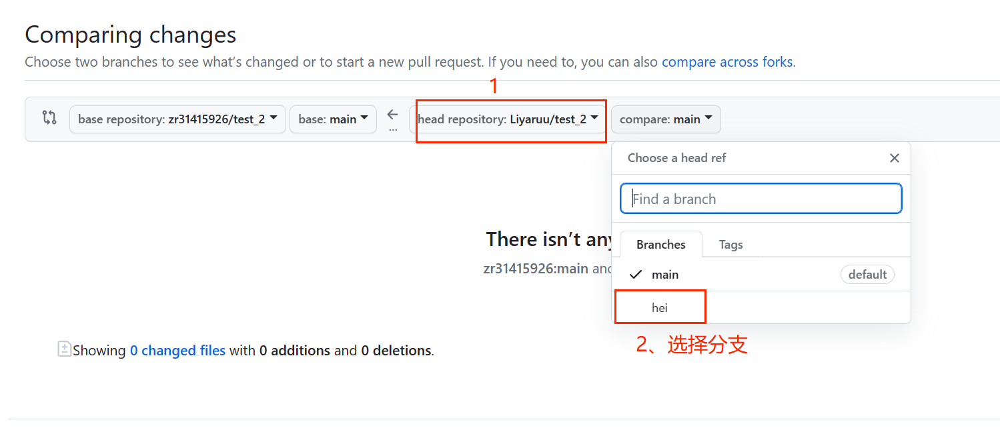
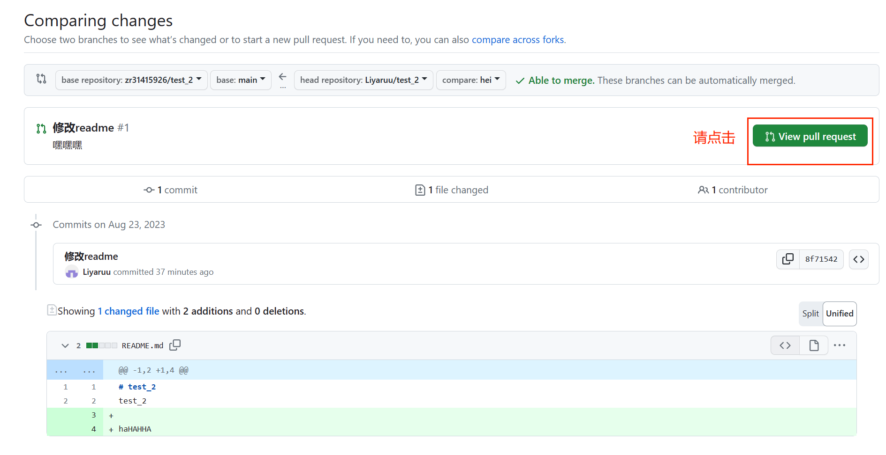

# 2023/8/21 周报

## 1、clion-cubemx学习

### 1.1 新建项目


### 1.2 cubemx配置


配置后，点击上图右上角GENERATE CODE，close关闭回到clion界面。

### 1.3 CMakeLists.txt修改

==包含总文件夹和头文件所在文件夹==


### 1.4 stlink烧录


添加内容如下：

```
# choose st-link/j-link/dap-link etc.
#adapter driver cmsis-dap
#transport select swd
source [find interface/stlink.cfg]
transport select hla_swd
source [find target/stm32f4x.cfg]
# download speed = 10MHz
adapter speed 10000
```

### 1.5 运行/调试配置

烧录配置



调试配置





### 1.6 代码编写注意

- 代码要写在BEGIN END之间！！！

- cubemx已经生成中断入口函数，只需要找到回调函数编写中断处理内容即可。


- 使用printf

  在uart.c中添加以下内容即可

  ```c
  #ifdef __GNUC__
  #define PUTCHAR_PROTOTYPE int __io_putchar(int ch)
  #else
  #define PUTCHAR_PROTOTYPE int fputc(int ch, FILE *f)
  #endif
  
  PUTCHAR_PROTOTYPE
  {
      HAL_UART_Transmit(&huart6, (uint8_t *) &ch, 1, 0xFFFF);
      return ch;
  }
  
  int fgetc(FILE *f)
  {
  
      int ch;
      HAL_UART_Receive(&huart6, (uint8_t *)&ch, 1, 1000);
      return (ch);
  }
  
  ```


## 2、git-github多人协作

### 2.1 clone项目到本地





新建文件夹，输入以下命令

```shell
git clone [复制的SSH]
```

示例：

```shell
git clone git@github.com:Liyaruu/Mecha_dk.git
```

### 2.2 增添项目内容

根据需求增添项目内容或进行修改


### 2.3 新建分支

git分支命令

```shell
#列出所有分支
git branch

#列出远程分支
git branch -r

#新建一个分支，但依然停留在当前分支
git branch [name]

#跳转到分支下
git checkout name

# 新建一个分支，并切换到该分支
git checkout -b [branch]

# 删除分支
 git branch -d [branch-name]
```

示例：

```shell
#新建hei分支
git checkout -b hei
```

### 2.4 上传到远端

复制项目的链接到本仓库链接

```shell
#查看仓库链接
git  remote -v

#添加远端链接
git remote add upstream [上游项目的链接]
```

示例：

```shell
git remote add upstream \git@github.com:Z8MAN8/Mecha_dk.git

git add .
git commit -m "添加作业"
#push分支
git push -u origin hei 
```

打开远端仓库







### 学习中. . .
